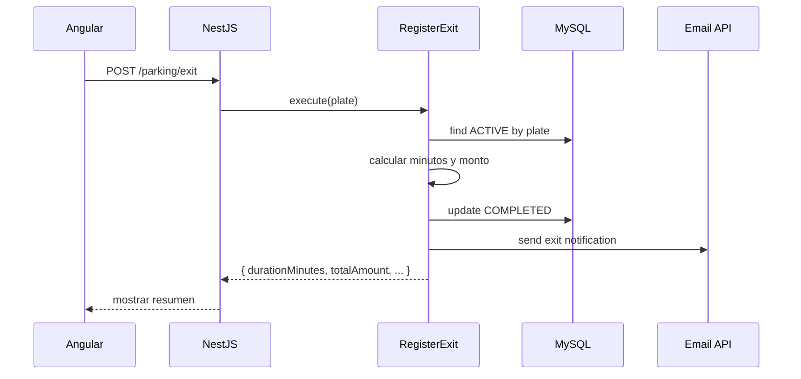

# Parqueadero — Especificación y arquitectura del proyecto

> **Documento maestro** para agentes y desarrolladores.  
> Contiene: requisitos de la prueba técnica, arquitectura (backend hexagonal + frontend Angular), modelo de datos MySQL, scripts SQL, reglas de negocio, endpoints y mapa de implementación.

---

## Índice

1. [Resumen del proyecto](#1-resumen-del-proyecto)
2. [Requerimientos funcionales](#2-requerimientos-funcionales)
3. [Reglas de negocio y lógica](#3-reglas-de-negocio-y-lógica)
4. [Base de datos MySQL](#4-base-de-datos-mysql)
5. [Stack tecnológico](#5-stack-tecnológico)
6. [Arquitectura backend (hexagonal)](#6-arquitectura-backend-hexagonal)
7. [Arquitectura frontend (Angular)](#7-arquitectura-frontend-angular)
8. [API REST (contrato)](#8-api-rest-contrato)
9. [Notificación por correo (API externa)](#9-notificación-por-correo-api-externa)
10. [Variables de entorno](#10-variables-de-entorno)
11. [Estructura de carpetas (esqueleto)](#11-estructura-de-carpetas-esqueleto)
12. [Mapa de implementación por capa](#12-mapa-de-implementación-por-capa)
13. [Pruebas y calidad](#13-pruebas-y-calidad)
14. [Pasos de ejecución local](#14-pasos-de-ejecución-local)
15. [Checklist de entrega](#15-checklist-de-entrega)

---

## 1. Resumen del proyecto

**Objetivo:** Aplicación para gestión de un parqueadero que permita:

- Registrar **ingreso** y **salida** de vehículos (carro / moto).
- Calcular el **valor a pagar** según tiempo de permanencia.
- **Notificar por correo** la salida mediante una API externa.
- Diseño e implementación de **base de datos relacional** (MySQL).

**Alcance de esta documentación:**

| Componente | Ubicación futura | Estado en repo |
|------------|------------------|----------------|
| Backend API | `parquin-backend/` | **Implementado** (NestJS hexagonal) |
| Frontend UI | `parquin-frontend/` | **Implementado** (Angular 19) |
| Base de datos | `parquin-backend/database/*.sql` | **Scripts listos** |

**Repositorio:** Proyecto **Parquin** — gestión de parqueadero. La lógica anterior de pagos (paymenTarget) fue eliminada.

---

## 2. Requerimientos funcionales

### 2.1 Gestión de vehículos — Ingreso

| Campo | Tipo | Obligatorio | Notas |
|-------|------|-------------|-------|
| `vehicleTypeId` | number | Sí | Referencia a `vehicle_types.id` |
| `plate` | string | Sí | Normalizar: mayúsculas, sin espacios |
| `clientName` | string | No | Si se envía, `clientEmail` también debe venir |
| `clientEmail` | string | No | Se usa para notificación al salir (puede pedirse en salida si no se registró) |
| `clientPhone` | string | No | Opcional |
| `entryAt` | datetime | Automático | Por defecto: **ahora** (servidor) |

**Reglas:**

- No permitir un segundo ingreso **ACTIVE** para la misma placa.
- Persistir sesión con `status = ACTIVE`.

### 2.2 Gestión de vehículos — Salida

| Campo | Tipo | Obligatorio | Notas |
|-------|------|-------------|-------|
| `plate` o `sessionId` | — | Sí | Identificar sesión activa |
| `exitAt` | datetime | Automático | **Siempre** `now()` en servidor |

**Al registrar salida el sistema debe:**

1. Cerrar la sesión (`status = COMPLETED`).
2. Calcular **duración en minutos**.
3. Calcular **valor total** (tarifa × minutos).
4. Invocar API externa de correo con resumen.
5. Devolver al cliente: tiempo total y valor total.

### 2.3 Cálculo de tarifa y visualización

| Concepto | Regla |
|----------|--------|
| Tarifa | **$50 por minuto** (configurable desde `tariff_rates`, siempre toma la activa) |
| Tiempo | Minutos entre `entry_at` y `exit_at` |
| Valor | `duration_minutes × rate_per_minute` |

**El frontend debe mostrar:**

- Tiempo total (minutos).
- Valor total a pagar (formato `$`).

---

## 3. Reglas de negocio y lógica

### 3.1 Cálculo de minutos

Usar reloj del **servidor** para `exit_at`.

```text
diffMs = exitAt.getTime() - entryAt.getTime()
durationMinutes = Math.max(1, Math.ceil(diffMs / 60_000))
```

| Caso | Comportamiento |
|------|----------------|
| Mismo minuto calendario pero &lt; 60 s | Mínimo **1 minuto** cobrable |
| 61–120 s | **2 minutos** |
| Salida antes de ingreso | Error de dominio |

> Ajustar a `Math.floor` solo si la prueba lo exige explícitamente; por defecto usar **ceil + mínimo 1** (estándar parqueaderos).

### 3.2 Cálculo de monto

```text
totalAmount = durationMinutes × ratePerMinute   // ratePerMinute = 50 desde BD o constante de dominio
```

Implementar en dominio como **servicio de dominio** o **value object** `ParkingFeeCalculator` (sin Nest).

### 3.3 Estados de sesión

```text
ACTIVE     → vehículo dentro del parqueadero
COMPLETED  → salida registrada, cobro calculado
```

### 3.4 Validaciones de dominio

| Validación | Mensaje sugerido |
|------------|------------------|
| Placa vacía | `Placa requerida` |
| Tipo de vehículo inválido | `Tipo de vehículo inválido` |
| Email inválido | `Correo inválido` |
| Ingreso duplicado activo | `Ya existe un vehículo activo con esta placa` |
| Salida sin sesión activa | `No hay ingreso activo para esta placa` |

### 3.5 Flujo de salida (secuencia)



---

## 4. Base de datos MySQL

### 4.1 Conexión (desarrollo)

```env
DB_HOST=localhost
DB_USER=root
DB_PASSWORD=1234
DB_NAME=parquin
DB_PORT=3306
```

### 4.2 Diagrama lógico

```text
┌─────────────────┐         ┌──────────────────────────────┐
│  tariff_rates   │         │      parking_sessions        │
├─────────────────┤         ├──────────────────────────────┤
│ id (PK)         │         │ id (PK)                      │
│ price_per_minute│◄─lógica─│ vehicle_type_id (FK)         │
│ is_active       │         │ client_id (FK nullable)      │
└─────────────────┘         │ plate                        │
                            │ entry_at                     │
                            │ exit_at                      │
                            │ duration_minutes             │
                            │ total_amount                 │
                            │ status (ACTIVE|COMPLETED)    │
                            │ email_sent / email_sent_at   │
                            └──────────────────────────────┘

┌─────────────────┐         ┌─────────────────┐
│  vehicle_types  │         │     clients     │
├─────────────────┤         ├─────────────────┤
│ id (PK)         │         │ id (PK)         │
│ code            │         │ name            │
│ name            │         │ email           │
│ is_active       │         │ phone           │
└─────────────────┘         └─────────────────┘
```

### 4.3 Scripts (ejecutar en orden)

```bash
# Desde la carpeta parqueadero/
mysql -u root -p < database/schema.sql
mysql -u root -p parquin < database/seed.sql
```

| Archivo | Contenido |
|---------|-----------|
| `database/schema.sql` | Crea BD `parquin`, tablas e índices |
| `database/seed.sql` | Inserta tarifa $50/min |

### 4.4 Tabla `parking_sessions` (referencia)

| Columna | Tipo | Descripción |
|---------|------|-------------|
| `id` | BIGINT | PK autoincrement |
| `vehicle_type_id` | TINYINT UNSIGNED | FK a `vehicle_types.id` |
| `plate` | VARCHAR(10) | Placa normalizada |
| `client_id` | BIGINT UNSIGNED NULL | FK a `clients.id` (nullable) |
| `entry_at` | DATETIME(3) | Ingreso |
| `exit_at` | DATETIME(3) NULL | Salida |
| `duration_minutes` | INT NULL | Al completar |
| `total_amount` | DECIMAL NULL | Monto calculado (formato `$` en UI) |
| `status` | ENUM | `ACTIVE`, `COMPLETED` |
| `email_sent` | TINYINT | 0/1 |
| `email_sent_at` | DATETIME NULL | — |

**Índice:** solo una fila `ACTIVE` por `plate` (índice funcional en `schema.sql`; si falla en tu MySQL, validar en caso de uso).

---

## 5. Stack tecnológico

| Capa | Tecnología | Notas |
|------|------------|-------|
| **Backend** | Node 20+, **NestJS** 11, **TypeScript** | Arquitectura hexagonal |
| **DB driver** | **mysql2/promise** | Queries SQL nativas, simples |
| **BD** | **MySQL 8** | Base `parquin` |
| **Frontend** | **Angular** 17+ | Requerido por prueba técnica |
| **HTTP cliente** | Angular `HttpClient` | — |
| **Tests backend** | Jest | Unit + e2e |
| **Tests frontend** | Jasmine / Karma o Jest (Angular CLI) | — |
| **Email** | API REST externa | Ver documentación entregada en la prueba |

---

## 6. Arquitectura backend (hexagonal)

### 6.1 Capas y dependencias

```text
HTTP → Controller (infrastructure/nestJs)
         → Use Case (application)
            → Domain (entidades + reglas + ports)
               ← Repository / EmailGateway (infrastructure)
```

**Prohibido:** lógica de tarifa o duración en el controller.

### 6.2 Estructura de carpetas

```text
backend/src/
├── domain/
│   ├── parking-session.ts              # Entidad
│   ├── session-status.ts               # Enum ACTIVE | COMPLETED
│   ├── parking-fee.calculator.ts       # Regla: minutos × tarifa
│   ├── parking-session.repository.ts   # Port
│   ├── tariff.repository.ts            # Port (leer tarifa activa)
│   └── email-notification.gateway.ts     # Port (enviar correo)
├── application/
│   └── parking/
│       ├── register-entry.use-case.ts
│       ├── register-exit.use-case.ts
│       ├── get-session.use-case.ts
│       └── list-active-sessions.use-case.ts
├── infrastructure/
│   ├── database/
│   │   ├── database.module.ts
│   │   └── mysql-pool.provider.ts
│   └── parking/
│       ├── nestJs/
│       │   ├── parking.controller.ts
│       │   ├── parking.module.ts
│       │   ├── parking.dto.ts
│       │   └── tokens.ts
│       └── sql/
│           ├── native-parking-session.repository.ts
│           ├── native-client.repository.ts
│           ├── native-vehicle-type.repository.ts
│           ├── native-tariff.repository.ts
│           └── parking-session-row.mapper.ts
│   └── notifications/
│       └── http/
│           └── email-api.gateway.ts      # Adapter API correo
├── app.module.ts
└── main.ts
```

### 6.3 Casos de uso (responsabilidades)

| Caso de uso | Entrada | Salida | Lógica |
|-------------|---------|--------|--------|
| `RegisterEntry` | tipo, placa, email | `{ sessionId, entryAt }` | Validar; rechazar si ACTIVE existe; `entryAt = now()` |
| `RegisterExit` | placa o id | `{ durationMinutes, totalAmount, entryAt, exitAt, plate, vehicleType }` | Buscar ACTIVE; calcular; COMPLETED; email |
| `GetSession` | id | Detalle sesión | Lectura |
| `ListActiveSessions` | — | Lista ACTIVE | Opcional para panel |

### 6.4 Ports (interfaces en domain)

```typescript
// parking-session.repository.ts (conceptual)
interface ParkingSessionRepository {
  save(session: ParkingSession): Promise<ParkingSession>;
  findActiveByPlate(plate: string): Promise<ParkingSession | null>;
  findById(id: number): Promise<ParkingSession | null>;
  update(session: ParkingSession): Promise<void>;
  listActive(): Promise<ParkingSession[]>;
}

// email-notification.gateway.ts
interface EmailNotificationGateway {
  sendExitNotification(payload: ExitEmailPayload): Promise<void>;
}
```

### 6.5 Wiring NestJS (tokens)

```typescript
// tokens.ts — ejemplo
export const PARKING_SESSION_REPOSITORY = Symbol('PARKING_SESSION_REPOSITORY');
export const TARIFF_REPOSITORY = Symbol('TARIFF_REPOSITORY');
export const EMAIL_NOTIFICATION_GATEWAY = Symbol('EMAIL_NOTIFICATION_GATEWAY');
export const REGISTER_ENTRY = Symbol('REGISTER_ENTRY');
export const REGISTER_EXIT = Symbol('REGISTER_EXIT');
```

Conexión a MySQL mediante `mysql2/promise` (pool) y un provider global `DatabaseModule`.

---

## 7. Arquitectura frontend (Angular)

### 7.1 Módulos sugeridos

```text
frontend/src/app/
├── core/                    # Singletons: interceptors, guards
│   └── services/
│       └── parking-api.service.ts
├── shared/                  # Componentes reutilizables
│   ├── pipes/
│   │   └── peso.pipe.ts
│   └── models/
│       └── parking-session.model.ts
└── features/
    └── parking/
        ├── pages/
        │   ├── entry-page/          # Registro ingreso
        │   ├── exit-page/           # Registro salida + resumen
        │   └── active-list-page/    # Opcional: vehículos dentro
        ├── components/
        │   ├── entry-form/
        │   └── exit-summary/
        └── parking.routes.ts
```

### 7.2 Pantallas mínimas

| Ruta | Componente | Función |
|------|------------|---------|
| `/ingreso` | `EntryPage` | Form: tipo, placa (+ cliente opcional) → POST entry |
| `/salida` | `ExitPage` | Form: placa → POST exit → muestra minutos y valor `$` |
| `/activos` | `ActiveListPage` | (Opcional) GET active |

### 7.3 Modelos TypeScript (frontend)

```typescript
export interface RegisterEntryRequest {
  vehicleTypeId: number;
  plate: string;
  clientName?: string;
  clientEmail?: string;
  clientPhone?: string;
}

export interface RegisterExitResponse {
  sessionId: number;
  plate: string;
  vehicleTypeCode: string;
  vehicleTypeName: string;
  entryAt: string;
  exitAt: string;
  durationMinutes: number;
  totalAmount: number;
  currency: string;
  ratePerMinute: number;
  emailSent: boolean;
}
```

### 7.4 Servicio API

```typescript
// parking-api.service.ts — métodos
registerEntry(body: RegisterEntryRequest): Observable<{ sessionId: number; entryAt: string }>
registerExit(plate: string): Observable<RegisterExitResponse>
listActive(): Observable<ParkingSessionSummary[]>
```

`environment.apiUrl` → `http://localhost:3000`

---

## 8. API REST (contrato)

Base: `http://localhost:3000` (o `PORT` del `.env`)

### 8.1 Registrar ingreso

```http
POST /parking/entry
Content-Type: application/json

{
  "vehicleTypeId": 1,
  "plate": "ABC123",
  "clientName": "Juan Pérez",
  "clientEmail": "conductor@ejemplo.com",
  "clientPhone": "3001234567"
}
```

**201 Created**

```json
{
  "sessionId": 1,
  "vehicleTypeId": 1,
  "vehicleTypeCode": "CAR",
  "vehicleTypeName": "Carro",
  "plate": "ABC123",
  "clientId": 10,
  "entryAt": "2026-05-25T10:00:00.000Z",
  "status": "ACTIVE"
}
```

**409 Conflict** — placa con sesión ACTIVE existente.

---

### 8.2 Registrar salida

```http
POST /parking/exit
Content-Type: application/json

{
  "plate": "ABC123"
}
```

**200 OK**

```json
{
  "sessionId": 1,
  "plate": "ABC123",
  "vehicleTypeCode": "CAR",
  "vehicleTypeName": "Carro",
  "entryAt": "2026-05-25T10:00:00.000Z",
  "exitAt": "2026-05-25T11:30:00.000Z",
  "durationMinutes": 90,
  "totalAmount": 4500,
  "currency": "USD",
  "ratePerMinute": 50,
  "emailSent": true
}
```

**404** — no hay sesión ACTIVE para la placa.

---

### 8.3 Consultar sesión

```http
GET /parking/sessions/:id
```

**200 OK** — detalle (activa o completada).

---

### 8.4 Listar vehículos activos (opcional)

```http
GET /parking/active
```

**200 OK** — array de sesiones `ACTIVE`.

---

### 8.5 Health

```http
GET /health
```

**200** `{ "status": "ok" }`

---

## 9. Notificación por correo (API Similtech)

Documentación: https://dev-sites.similtech.co/api-email/swagger/index.html

### 9.1 Flujo al registrar salida

1. `POST {EMAIL_API_BASE_URL}/api/token` — credenciales → JWT.
2. `POST {EMAIL_API_BASE_URL}/api/email/sendEmail` — `Authorization: Bearer {token}`.
3. Si falla el correo, la salida **igual se guarda** (`email_sent` queda en 0).

### 9.2 Contenido del correo (mínimo exigido)

- Placa del vehículo  
- Tipo de vehículo (Carro / Moto)  
- Tiempo total (minutos)  
- Valor pagado (formato `$`)  
- Ingreso y salida (fechas)

### 9.3 Variables `.env`

```env
EMAIL_API_BASE_URL=https://dev-sites.similtech.co/api-email
EMAIL_API_USERNAME=proceso_pruebas
EMAIL_API_PASSWORD=tu_contraseña
EMAIL_ID_USER=parquin
EMAIL_ORIGEN=noreply@parquin.local
# Opcional:
# EMAIL_URL_HEADER=https://...
# EMAIL_URL_FOOTER=https://...
```

`idMessage` se genera único por salida: `parquin-exit-{sessionId}-{timestamp}` (requisito API: no repetir el mismo id el mismo día).

---

## 10. Variables de entorno

Copiar `parquin-backend/.env.example` → `parquin-backend/.env`:

```env
DB_HOST=localhost
DB_USER=root
DB_PASSWORD=1234
DB_NAME=parquin
DB_PORT=3306

PORT=3000
NODE_ENV=development

EMAIL_API_BASE_URL=https://dev-sites.similtech.co/api-email
EMAIL_API_USERNAME=
EMAIL_API_PASSWORD=
EMAIL_ID_USER=parquin
EMAIL_ORIGEN=noreply@parquin.local
```

Frontend `parquin-frontend/src/environments/environment.ts`:

```typescript
export const environment = {
  production: false,
  apiUrl: 'http://localhost:3000',
};
```

---

## 11. Estructura de carpetas (esqueleto)

Estructura actual del monorepo:

```text
paymenTarget/
├── README.md
├── parquin-backend/          ← NestJS hexagonal + database/
│   ├── README.md             ← Este archivo
│   ├── .env.example
│   ├── database/
│   └── src/
└── parquin-frontend/         ← Angular 19
    └── src/app/
```

---

## 12. Mapa de implementación por capa

| RF Prueba | Backend | Frontend |
|-----------|---------|----------|
| Ingreso vehículo | `RegisterEntry` + `POST /parking/entry` | `EntryPage` + formulario |
| Salida + hora automática | `RegisterExit` + `exitAt = now()` | `ExitPage` |
| Tiempo en minutos | `ParkingFeeCalculator` | Mostrar en `ExitSummary` |
| Tarifa $50/min | `tariff_rates` (activa) + calculator | Mostrar `ratePerMinute` |
| Valor total | `total_amount` en respuesta | Formato `$` |
| Correo salida | `EmailNotificationGateway` | — |
| BD relacional | `database/*.sql` | — |

### 12.1 Orden recomendado de desarrollo

1. Ejecutar scripts SQL y verificar tablas.
2. Backend: domain → application → infrastructure (sql/http) → controller.
3. Probar API con REST Client / Postman.
4. Frontend Angular: servicio → páginas ingreso/salida.
5. Integrar API de correo.
6. Tests unitarios casos de uso (mocks) + e2e endpoints críticos.

---

## 13. Pruebas y calidad

### 13.1 Backend (Jest)

| Archivo | Qué probar |
|---------|------------|
| `parking-fee.calculator.spec.ts` | 0s → 1 min; 61s → 2 min; 50×minutos |
| `register-entry.use-case.spec.ts` | Duplicado ACTIVE → error |
| `register-exit.use-case.spec.ts` | Cálculo + llamada a email gateway mock |
| `parking.controller.spec.ts` | HTTP status codes |

### 13.2 Frontend

| Spec | Qué probar |
|------|------------|
| `EntryPage` | Formulario válido llama API |
| `ExitPage` | Muestra `durationMinutes` y `totalAmount` tras respuesta |

### 13.3 Criterios SOLID / Clean Code (objetivo)

- **SRP:** un caso de uso por acción (entry / exit).
- **DIP:** use cases dependen de ports, no de axios/infra.
- **Sin** `console.log` en flujos de producción.

---

## 14. Pasos de ejecución local

### 14.1 Base de datos

```bash
cd parquin-backend
mysql -u root -p < database/schema.sql
mysql -u root -p < database/seed.sql
```

Verificar:

```sql
USE parquin;
SHOW TABLES;
SELECT * FROM tariff_rates;
```

### 14.2 Backend

```bash
cd parquin-backend
npm install
cp .env.example .env
npm run start:dev
```

### 14.3 Frontend

```bash
cd parquin-frontend
npm install
npm start
```

---

## 15. Checklist de entrega

- [ ] Scripts SQL ejecutados en MySQL (`parquin`)
- [ ] Ingreso: tipo, placa, fecha/hora ingreso
- [ ] Salida: fecha/hora automática, minutos calculados
- [ ] Tarifa $50/min y total visible en UI
- [ ] Correo al salir vía API externa documentada
- [ ] Frontend Angular + Backend NestJS hexagonal
- [ ] README y `.env.example` actualizados
- [ ] Tests de calculadora y casos de uso

---

## Notas para el agente de Cursor

1. Leer **sección 3** (lógica) antes de modificar calculadora o salida.
2. Usar **scripts en `parquin-backend/database/`** (no hay auto-sync).
3. Código de dominio en `parquin-backend/src/domain/` y `application/`.
4. UI en `parquin-frontend/src/app/features/parking/`.
5. Credenciales solo en `.env`, nunca en el repo.
6. Integrar **API de correo** en `EmailApiGateway` cuando tengas la documentación oficial.
